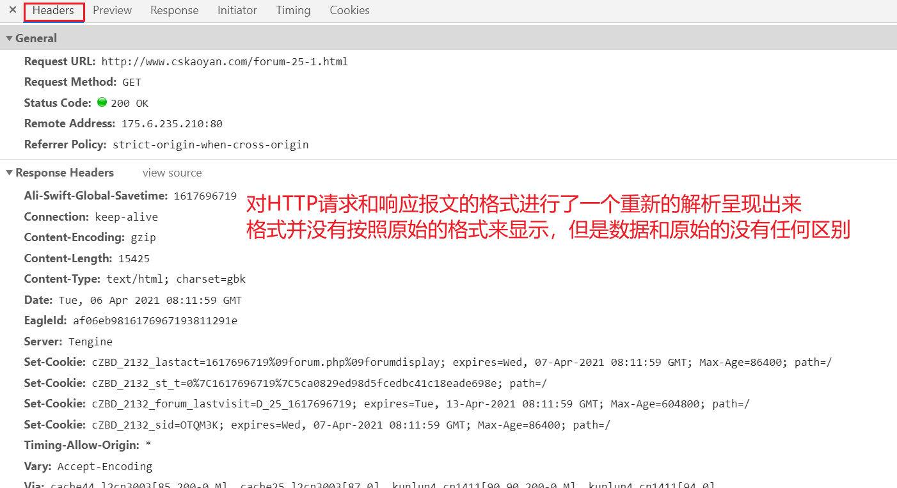

# 自我介绍

远志。

EE阶段基础知识点、项目一


半个月左右


网络编程的一个延续。


## 学习方式

1.注重课堂上面的听讲，不要过多依赖于课后的视频。视频只是作为一个辅助

2.课堂上面尽量不要自己去搜索，等你搜索回来，你发现已经听不懂了

3.有疑问的话，可以自己用笔记记录下来，课后花时间去梳理一下

​	笔记的记录还是挺重要的。不需要记非常详细的记录，把整个思路记录下来。

​	课后根据自己记录的思路尽可能去复现上课的代码（如果不会的地方，直接记录一个问号之类的）

4.代码的编写（上课可以听懂，自己写不出来）

其实这不算一个问题，代码量不够的一个体现，多写代码即可。码感

写代码的讲究：

课堂的案例大家如何去写的？

1.对着抄一遍（效果不是特别的好，但是也是有效果的）

2.尽自己所能，先自己去尝试把一部分代码写出来，写不出来的部分，先自己思考，哪点没想明白，那么看一遍参考代码

把参考代码关闭，接下来继续重复上面的内容。


一定要有独立思考的习惯

不要遇到问题第一时间就想着求助别人，先自己尝试去解决（搜索引擎、csdn、博客园）

初阶、中阶、高阶


建议大家都去做的事情：

**1.认真去梳理你在编程过程中遇到的bug，形成一个bug-list（因果关系，学会怎么去看报错信息，怎么从bug中推测到你的问题所在）**


NullPointException

# EE

## 基础性概念

SE

EE：Eneterprise Edition.企业版。给企业开发者来使用的，企业级别的应用其实是很复杂的，单纯利用SE阶段学习的API的确可以完成我们的需求，但是需要做很多重复性的、冗余的工作，那么我们可以对SE的代码进行进一步的封装、简化，形式一套新的API，这个就叫做EE。

客户端：用户使用的一个app，比如手机上面的淘宝、京东这些应用

浏览器：利用浏览器也可以去访问淘宝、京东

服务器：其实你就可以理解为淘宝、京东之类的


通讯双方进行沟通，其实不就是建立一个socket嘛？

客户端其实就可以向服务器去发送数据了

服务器也可以给客户端去响应数据了


如果数据量很多，里面包含的内容也非常多，那么我怎么去传输这些内容比较合适呢？

去传输学生的信息（学生信息有很多属性，同时有很多学生）

按照某种格式来进行传输

比如，双方约定按照这种格式来：

学生姓名  年龄 籍贯 专业

张三	23	湖北省	java

李四	25	江苏省	c++

王五	27	浙江省	python


通讯的另一方如果想要能够解析出里面的学生信息，如何解析呢？

1.利用换行符进行分割，可以分割出每个学生

2.再利用空格，可以分割出学生姓名、年龄、籍贯、专业

最终就可以形成一个List<Student>


这里面能够进行正常沟通的前提条件是什么呢？双方的通讯具有固定的格式，又可以取一个专业的名称，叫做协议。


# HTTP

HTTP协议。遵守着固定的格式的一个传输的消息。约束着传输的内容应该具有某种格式，这样通讯的双方才可以正常沟通、解析出来。


涉及到了网络的信息传输，所以不可避免地就会涉及到网络的模型。

一类是TCP/IP模型，一类是OSI参考模型

以快递的运输为例

商家想要把货物发送给你，首先需要有**你的通讯地址（ip地址）**、**快递物流行业的支持（网络相关硬件的支持，网卡，驱动）**、**包裹的投递方式（确保你收到货，我只负责发货，收不收到那就不关我的事了）（TCP、UDP）**


网络的传输过程其实是非常复杂的，需要很多组件一起来协调运行。比如需要底层硬件网卡等的支持、还需要知道对方的通讯地址才可以去发送请求、

网路模型主要说的事情就是分层，分而治之的思想。

商家如果想投递包裹，它不会自己去组建一个物流，然后自己去投递


网络通讯其实也是一样，如果客户端（通讯的一方）希望将某个数据发送给服务器（通讯的另一方），不会自己去组建底层的网络设施，它肯定会使用一个现成的，利用底层的基础设施架构来完成数据的传输，这个就是网络模型。

将整个网络进行了一个细致的划分，划分成4层（TCP/IP模型）

应用层（就是我们真正希望传输给另一方的数据）

传输层（TCP、UDP）

网络层（IP，知道你的通讯地址）

链路层（底层的硬件相关）


## 工作流程

全程叫做Hyper Text Transfer/Transport Protocol

超文本传输协议

html

超文本标记语言

历史 tim bernes lee


依赖于底层的网络架构、设施

**1.域名解析**

主要是方便人的使用而创建的一个东西，对于计算机来说，计算机最喜欢的是ip地址，

做一个映射就可以了

xxx.com --------------------------xxx.xxx.xxx.xxx    特殊含义的字符串  来和ip地址做一个绑定

会涉及到一个域名解析成为ip地址的过程，这个步骤叫做DNS  域名解析

域名解析服务器，默认情况下是不需要自己配置的，网络供应商会提供的

8.8.8.8域名解析服务器，google提供的一个域名解析服务器。ios testflight


涉及到很多步骤：

1.搜索浏览器自身DNS缓存（一般情况下，第一次访问某个网站你会发觉略微慢一些）

2.搜索操作系统自身DNS缓存

3.读取hosts文件

**2.发起TCP三次握手**

主要是为了建立一个可靠的连接通路。


**3.发起HTTP请求（包裹的包装）**

包裹如果非常大，需要拆包，拆成很多个片段（TCP拆包，标注出包裹-1，包裹-2，包裹-3）

还需要贴上目的地的标签（IP地址 发送方ip地址、接收方的ip地址）

需要经过物流的门店进入到一个区的枢纽，进而进入到一个城市的中转枢纽（路由）

空运、陆运

到达目的城市，进入到城市中心枢纽，进入到区枢纽，进而分发到对应的门店，派送


拆包裹，拿到了最初的数据


**4.服务器做出响应**

服务器解析出了你的请求真实意图，接下来需要做出针对性的响应，比如你请求首页，那么返回首页，比如你请求商品页，那么应当返回商品页


**5.浏览器去解析拿到的HTML标签、css、js等，解析**


**6.渲染页面，将最终的结果呈现给用户**


## HTTP协议

HTTP协议其实就是对客户端发出的请求信息以及对服务器做出的响应信息的一个**约束**、**规范**。发送方传输的请求消息应该具有某种格式，服务器返回的响应消息应该具有某种格式，只有双方都遵守着这个**格式**，那么才能够顺利地解析出里面的内容。


客户端发出的请求消息，一般称之为HTTP请求报文

服务器返回的响应消息，一般称之为HTTP响应报文


### HTTP请求报文

**HTTP请求报文应该具有如下格式：**

请求行：请求方法  请求资源 版本协议（换行符\r\n）

请求头（附着若干请求头）

(空行\r\n)

请求体（传输大量的数据）

#### 请求方法

 	一般情况下有GET、POST、HEAD、OPTIONS、DELETE等，但是最为常用的其实只有**GET、POST**

通过实际的实验来验证一下，是否如所说的那样

**fiddler**


GET和POST有什么样的区别呢？

如何去发送一个GET请求呢？

表单提交、**直接在浏览器地址栏输入网址，就是GET请求**（一般情况下，如果没有特殊说明，99%的情况下，浏览器默认发送的都是GET请求）


发送一个POST请求


**GET、POST的区别呢？**

**并不是说请求参数在的位置，这个不是GET、POST的区别。出现这个情况的原因仅仅只是因为浏览器发送POST请求时，会默认把请求参数放置在请求体中。**


GET、POST区别其实更多的是关于语义上的区别。

制定的规则，赋予了它的这个区别。从技术层面没有任何区别，区别仅仅在于语义上面

语义：

**GET--更多的是用来获取数据**

**POST---更多的是用来提交数据**

选用哪种请求方式，应该根据语义来，比如希望获取某个商品信息，比如登录网站

#### 请求资源

比如我分别去访问/forum.php页面以及/forum-25-1.html，这两个请求需要返回的页面应当是不一样的，需要通过请求报文去分析出请求的意图


所以呢，此时我就可以通过去解析出请求资源，也就能够拿到客户端真实访问意图。


#### 版本协议

HTTP/1.1目前你可以认为只有这一个固定的版本，固定的写法。

上一个版本是1.0版本

1.0和1.1版本的区别还是比较大的：

​	**1.0默认不支持长连接的，发送完当前HTTP请求，服务器做出响应之后，随即当前TCP连接断开，下次如果需要重新访问，那么需要重新建立TCP连接。**

​	**1.1版本，目前的版本，默认支持长连接的。可以在一个TCP连接里面，发送多个HTTP请求和响应。**

#### 请求头

额外的补充一些通讯的条款。

请求头是给服务器去看的。

MIME：是利用一种格式   **大类型/小类型**  将互联网上面的所有资源进行一个分类

图片、文本、音频、视频

image/jpeg、image/png

text/html、text/txt

audio/mp3

video/mp4

Accept:浏览器可接受的    MIME类型 */*   (大类型)/(小类型)
Accept-Charset: 浏览器通过这个头告诉服务器，它支持哪种字符集
Accept-Encoding:浏览器能够进行解码的数据编码方式，比如gzip （压缩格式）
Accept-Language: 浏览器所希望的语言种类，当服务器能够提供一种以上的语言版本时要用到。 可以在浏览器中进行设置。

youtube、google

**Host:初始URL中的主机和端口 （每个请求报文中一定要有的）**
**Referer**:包含一个URL，用户从该URL代表的页面出发访问当前请求的页面 （防盗链）(引流)

google广告联盟

qq空间的图片（在空间里面可以看到，但是在外部看不到）

假设有两种方式访问某个页面，

一种呢，先进入到首页，然后点击某个链接进入到该页面


方式二，直接把该页面的链接记住，然后再浏览器里面直接输入该地址


从HTTP请求报文中能不能区分它采用的是哪种方式呢？

Content-Type:内容类型（客户端和服务器都可以使用，但是服务器使用的更多一些）

If-Modified-Since: Wed, 02 Feb 2011 12:04:56 GMT 服务器利用这个头与服务器的文件进行比对，如果一致，则告诉浏览器从缓存中直接读取文件。
User-Agent:浏览器类型.
Content-Length:表示请求消息正文的长度 
Connection:表示是否需要持久连接。如果服务器看到这里的值为“Keep -Alive”，或者看到请求使用的是HTTP 1.1（HTTP 1.1默认进行持久连接 
Cookie:这是最重要的请求头信息之一 
Date：Date: Mon, 22 Aug 2011 01:55:39 GMT请求时间GMT


#### 请求体

**请求体通常也称之为请求正文**。可以存放着大量的数据，如果你有很多的数据需要传输给服务器，那么就可以把它放在请求体里面。


### HTTP响应报文

服务器返回给客户端的响应消息，如果希望能够被客户端正确的处理、解析，这个时候也是需要去遵守某个规则的

HTTP协议对响应报文的约束和要求，HTTP响应报文也应当具有如下格式：

响应行: 版本协议  状态码  原因描述

响应头

(空行)

响应体（正文）


#### 状态码

1.200 表示整个请求响应过程没有任何问题 一切正常

2.404 **表示的是可以正常去响应，只是此时请求的资源在服务器上面不存在**

3.302、307 表示的是重定向

www.bing.com

**302、307状态码一定要搭配着一个响应头来一起使用**

**Location：新的地址**

需要再次向一个新的地址去发起新的请求

304状态码  表示的是缓存 客户端存储的资源文件是最新的，可以继续使用


500表示的是服务器异常。

服务器出现了bug。

接下来进行服务器相关的开发，**如果一个请求返回了500状态码，一定要切记一点，你的程序有问题**。

debug。

一般情况下而言，错误都是有错误日志的，所以一定要去找错误日志。

如果没有，可以去看一下catch代码块里面是不是没有写e.printStackTrace();

一步一步debug，一般情况下都是可以找到报错原因的。




#### 响应头

Location: http://www.cskaoyan.com/指示新的资源的位置 ，需要搭配302、307状态码一起来使用
Server: apache tomcat 指示服务器的类型
Content-Encoding: gzip 服务器发送的数据采用的编码类型
Content-Length: 80 告诉浏览器**响应正文**的长度
Content-Language: zh-cn服务发送的文本的语言
**Content-Type**: text/html;  服务器发送的内容的MIME类型.

**比如图片类型应该是image/jpeg等，但是如果你设置了text/html，那么浏览器可能就无法正常显示**

Last-Modified: Tue, 11 Jul 2000 18:23:51 GMT文件的最后修改时间
Refresh: 1;url=http://www.cskaoyan.com指示客户端刷新频率。单位是秒。页面跳转的一个响应头

Content-Disposition: attachment; filename=aaa.zip指示客户端保存文件。如果你的响应中又这个响应头，那么浏览器会将当前资源以附件的形式下载下来。
Set-Cookie: SS=Q0=5Lb_nQ; path=/search服务器端发送的Cookie
Expires: 0
Cache-Control: no-cache (1.1)  
Connection: close/Keep-Alive   
Date: Tue, 11 Jul 2000 18:23:51 GMT

#### 响应体

如果服务器需要将大量的数据传输给客户端，那么就把数据写入到响应体中。


## HTTPS（了解）

HTTPS = Http + secure

分析一下HTTP有哪些劣势：

1.通讯过程全程明文传输

2.也没有验证通讯另一方的身份

3.没有一个完整性的校验，如果报文内容部分被篡改，也发现不了


HTTPS其实就是为了解决这三个问题

1.加密就行了

（加密算法：对称加密（加密使用的秘钥和解密使用的秘钥是同一把，特点是速度很快）、非对称加密（用公钥加密之后，只有私钥才可以解密，其他公钥是无法解密的， **特点是安全性非常高，但是速度很慢**））

**HTTPS采用的是混合加密**

2.证书

一般是由证书的权威机构颁发给某个网站的。很难伪造


3.完整性校验


# 服务器

什么是服务器呢？

服务器一般情况下，我们可以从软硬件去分析。

硬件：一个高性能的计算机。云服务器

软件：一个软件程序。


为什么需要有服务器？

架设当前电脑上面有两个页面，1.html   2.html

别人访问我的电脑时，根据它的请求，返回1.html  或者返回2.html

**如何把一个文件里面的内容发送给通讯的另一方**

SE

```java
import java.io.IOException;
import java.io.InputStream;
import java.io.OutputStream;
import java.net.ServerSocket;
import java.net.Socket;

public class Server {

    public static void main(String[] args) {
        //网络编程  TCP
        try {
            //持续监听8090端口号
            ServerSocket serverSocket = new ServerSocket(8090);
            //监听有没有通讯的另一端连接进来 如果没有通讯方连接进来，会一直阻塞在这个地方
            Socket socket = serverSocket.accept();
            InputStream inputStream = socket.getInputStream();
            byte[] bytes = new byte[1024];
            int length = inputStream.read(bytes);
            String s = new String(bytes, 0, length);
            System.out.println(s);
            OutputStream outputStream = socket.getOutputStream();
            //这里再把1.html里面的内容写出去
            //outputStream.write();
        } catch (IOException e) {
            e.printStackTrace();
        }

    }
}
```


写了一段程序，可以用来处理访问1.html的请求，

接下来如果要访问其他的页面，比如2.html，那么这里面基本90%的代码是可以复用的

里面的重复性代码其实是没有必要再去写一遍的

这块代码完全可以复用。

将这些代码写成一个软件，这个软件可以去将很多页面响应出去。其实就是服务器。

**这个程序可以将任意的文件写出去。**


**服务器本质：**

**就是将本地硬盘上面的资源文件共享给网络上面的其他用户来使用。**


## 实现简易服务器

底层还是依赖于SE阶段学习的网络编程

比如，希望能够去处理请求，将请求对应的页面响应给客户端

分别发了两个请求，一个请求1.html，一个请求2.html

GET **/1.html** HTTP/1.1
Host: localhost:8090
Connection: keep-alive
sec-ch-ua: "Google Chrome";v="89", "Chromium";v="89", ";Not A Brand";v="99"
sec-ch-ua-mobile: ?0
Upgrade-Insecure-Requests: 1
User-Agent: Mozilla/5.0 (Windows NT 10.0; Win64; x64) AppleWebKit/537.36 (KHTML, like Gecko) Chrome/89.0.4389.90 Safari/537.36
Accept: text/html,application/xhtml+xml,application/xml;q=0.9,image/avif,image/webp,image/apng,*/*;q=0.8,application/signed-exchange;v=b3;q=0.9
Sec-Fetch-Site: none
Sec-Fetch-Mode: navigate
Sec-Fetch-User: ?1
Sec-Fetch-Dest: document
Accept-Encoding: gzip, deflate, br
Accept-Language: zh-CN,zh;q=0.9


================================================================

GET **/2.html** HTTP/1.1
Host: localhost:8090
Connection: keep-alive
sec-ch-ua: "Google Chrome";v="89", "Chromium";v="89", ";Not A Brand";v="99"
sec-ch-ua-mobile: ?0
Upgrade-Insecure-Requests: 1
User-Agent: Mozilla/5.0 (Windows NT 10.0; Win64; x64) AppleWebKit/537.36 (KHTML, like Gecko) Chrome/89.0.4389.90 Safari/537.36
Accept: text/html,application/xhtml+xml,application/xml;q=0.9,image/avif,image/webp,image/apng,*/*;q=0.8,application/signed-exchange;v=b3;q=0.9
Sec-Fetch-Site: none
Sec-Fetch-Mode: navigate
Sec-Fetch-User: ?1
Sec-Fetch-Dest: document
Accept-Encoding: gzip, deflate, br
Accept-Language: zh-CN,zh;q=0.9

可以利用请求资源区分不同的请求意图


根据HTTP请求响应的规则：

通过请求报文，找出对应的请求资源

根据请求资源是否存在，进而给客户端做出对应的响应

如果存在，那么应当返回200状态码，同时将文件的内容写入到响应体中

如果不存在，那么应当返回404状态码


处理方式：

最简单的就是在字符串里面去找/，如果找到，那么/后面的字符以及空格之间的部分就是我们的请求资源

可行的

但是，今后可能还需要获取请求报文的其他各个部分，还需要自己再重新去解析一次，非常的麻烦，做重复性工作

一劳永逸的方法呢？

**面向对象的思想**。将请求报文的所有内容进行拆解，然后封装到一个Request对象中。


## TODO

1.回顾一下之前的网络编程

2.HTTP协议理解

3.抓包（还是去抓www.bing.com，把流程分析一下，最好以word、typora的形式，提交的时候可以选择导出为pdf，如果直接导出typora，一定要设置好图片）

